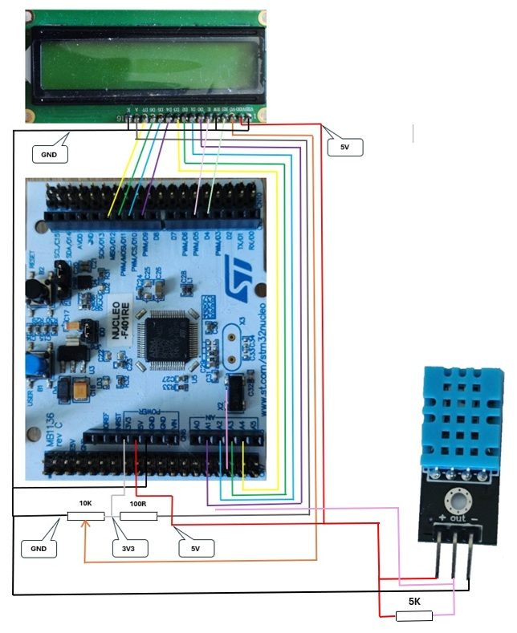
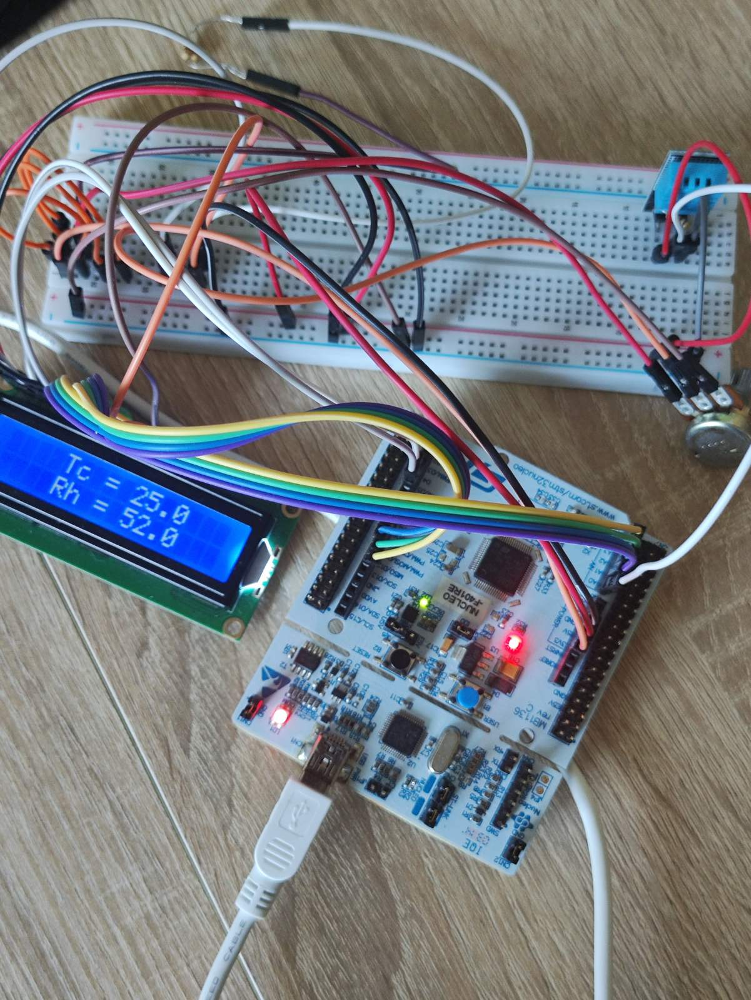
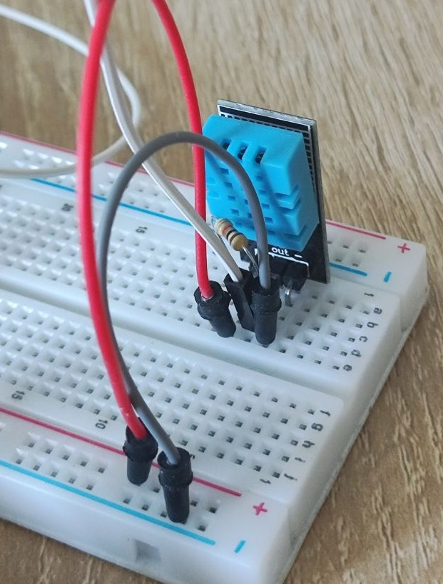
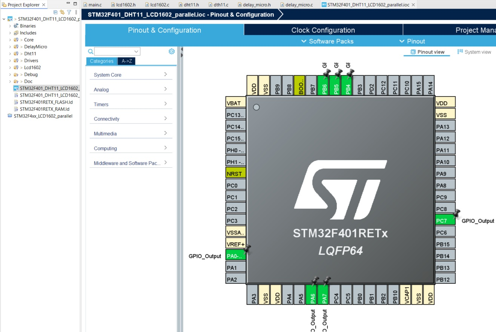
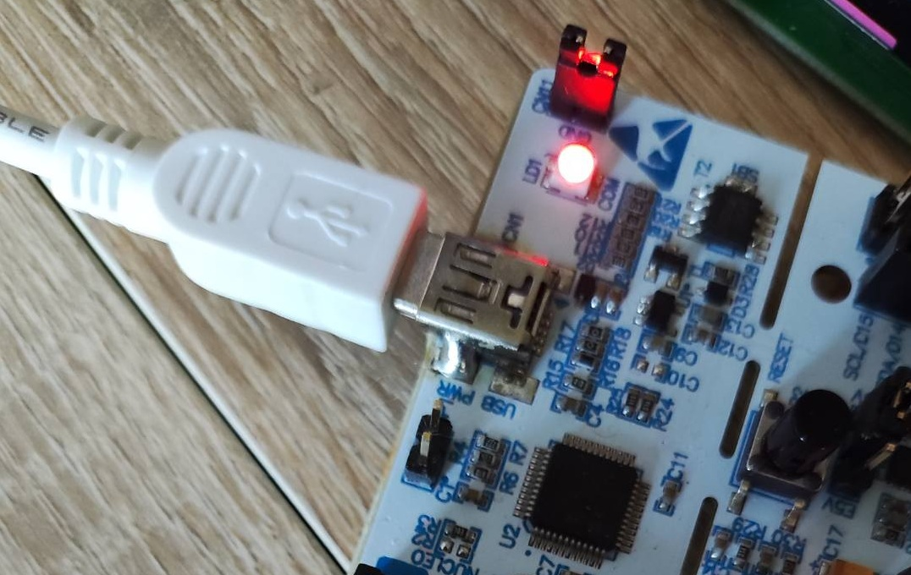
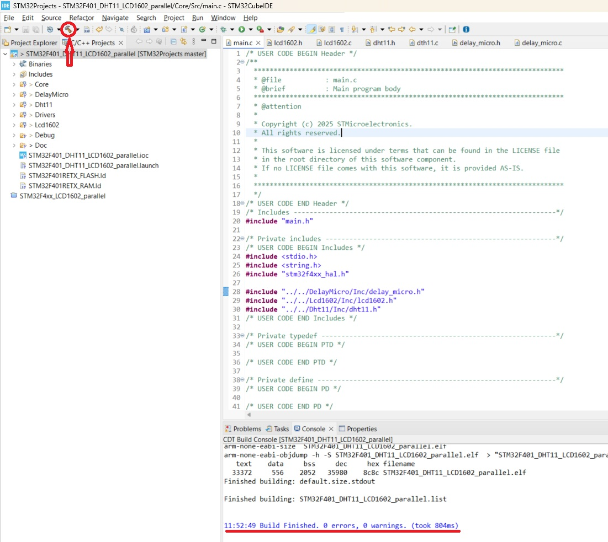
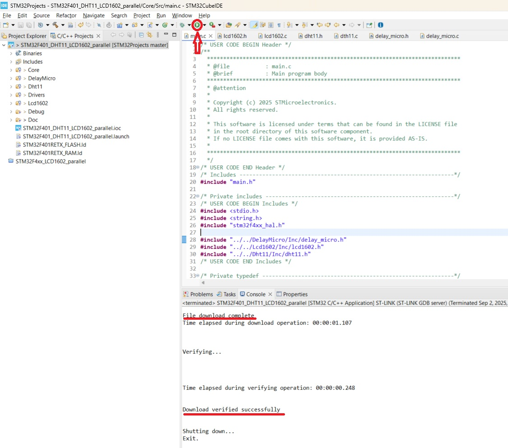

# DHT11 sensor and LCD1602 Display connected to STM32F4xx board

This STM32 Project is intended to create an API that would help:
- to connect LCD1602 Display to the STM32F4xx board by means of 4-bit or 8-bit parallel data bus;
- to connect DHT11 humidity and temperature sensor to the STM32F4xx board;
- to perfor microsecond and millisecond delays by using ***System Core Clock*** and timer ***TIM2***.

The project is based on the [***STM32 Cube Hardware Abstraction Layer (HAL) library***](https://www.st.com/resource/en/user_manual/um1725-description-of-stm32f4-hal-and-lowlayer-drivers-stmicroelectronics.pdf).  

The project demonstrates how to use DHT11 humidity and temperature sensor and LCD1602 Display features with proposed API.  

## Contents

- [Contents](#contents_id)
- [Features](#features_id)
- [Installation](#installation_id)
- [Configuration](#configuration_id)

    - [Hardare elements](#hardware_elements_id)
    - [Hardware connection](#hardware_connection_id)
    - [GPIO configuration](#gpio_configuration_id)

- [Usage](#usage_id)
- [License](#license_id)
- [Acknowledgements](#acknowledgements_id)
- [Contacts](#contacts_id)

## Features

This project includes three libraries. They are:

- ***Lcd1602 library***. This library was described and demonstrated in the STM32 Project [***STM32F4xx_LCD1602_parallel***](https://github.com/Oleh-Dubrovskyi/STM32Projects/tree/master/STM32F4xx_LCD1602_parallel)
- ***Dht11 library***. This library includes all needed API functions to communicate with [***DHT11 sencor***](https://www.mouser.com/datasheet/2/758/DHT11-Technical-Data-Sheet-Translated-Version-1143054.pdf) to get current values of humidity and temperature.
- ***DelayMicro library***. This library intended to perform microsecond and millisecond delays that are needed to support the DTH11 communication protocol.

The result application communicates with DHT11 sensor and shows current temperature and humidity on the LCD1602 Display.

## Installation

1. In case you decide to build and run this project you should [***install the STM32CubeIDE***](https://www.st.com/resource/en/user_manual/um2563-stm32cubeide-installation-guide-stmicroelectronics.pdf) in your computer.
2. To clone a project from GitHub and import it into your STM32CubeIDE workspace, follow these steps:
    - Clone the Repository Locally by means of Git client or by using `git clone` command.
    - Import STM32 Project ***STM32F401_DHT11_LCD1602_parallel*** into your STM32CubeIDE workspace
        - Open STM32CubeIDE and ensure you are in the desired workspace.
        - Navigate to *File* > *Import*: in the top menu bar.
        - In the *Import* window, expand the *General* folder and select *Existing Projects into Workspace*. Click *Next*.
        - On the next screen, you will have two options for selecting the project: *Select root directory* and *Select archive file*.
        - Select root directory: Click *Browse...* and navigate to the root directory of the STM32 project ***STM32F401_DHT11_LCD1602_parallel*** on your file system.  
          This directory should contain file `.project`.  
          Once the directory is selected, STM32CubeIDE will display the projects found within that location.  
          Select the project ***STM32F401_DHT11_LCD1602_parallel*** to import it into your workspace.
          *Optional:* If you want a copy of the project files to be placed within your workspace directory, check the *Copy projects into workspace* option.  
          If you leave this unchecked, the project will be linked to its original location on the file system.
        - Click *Finish* to complete the import process.  
          The project ***STM32F401_DHT11_LCD1602_parallel*** will now appear in your STM32CubeIDE Project Explorer.

## Configuration

### Hardare elements

The project ***STM32F401_DHT11_LCD1602_parallel*** requires such hardware elements:

- NUCLEO-F401RE board
- LCD1602 Display
- DHT11 sensor
- Variable resistor 10 kOM
- Resistor 100 OM
- Resistor 5 kOM

### Hardware connection

1. Connect the LCD1602 VSS (pin 1), RW (pin 5), and K (pin 16) to NUCLEO-F401RE GND (pin CN6-6) and to the left contact of the variable resistor 10 kOM.
2. Connect the LCD1602 VDD (pin 2) to the NUCLEO-F401RE +5V (pin CN6-5).
3. Connect the LCD1602 V0 (pin 3) to the middle contact of the variable resistor 10 kOM.
4. Connect the right contact of the variable resistor to the NUCLEO-F401RE 3V3 (pin CN6-4) and to the left contact of the Resistor 100 OM.
5. Connect the right contact of the Resistor 100 OM to the LCD1602 A (pin 15).
6. Connect the LCD1602 RS (pin 4) to the NUCLEO-F401RE D4 (PB5, CN9-5).
7. Connect the LCD1602 E (pin 6) to the NUCLEO-F401RE D5 (PB4, CN9-6).
8. Connect (***optionally***) the LCD1602 D0, D1, D2, D3 (pins 7-10) to the NUCLEO-F401RE A1 (PA1, CN8-2), A2 (PA4, CN8-3), A3 (PB0, CN8-4), A4 (PC1, CN8-5).
9. Connect the LCD1602 D4, D5, D6, D7 (pins 11-14) to the NUCLEO-F401RE D9 (PC7, CN5-2), D10 (PB6, CN5-3), D11 (PA7, CN5-4), D12 (PA6, CN5-5).
10. Connect the DHT11 "***+***" (left pin) to the NUCLEO-F401RE +5V (pin CN6-5) and to the left contact of the resistor 5 kOM.
11. Connect the DHT11 "***-***" (right pin) to the NUCLEO-F401RE GND (pin CN6-6).
12. Connect the DHT11 "***Out***" (middle pin) to the NUCLEO-F401RE A0 (PA0, CN8-1) and to the right contact of the Resistor 5 kOM.

Please, take a look at the connection diagram:

  

The connections between NUCLEO-F401RE, LCD1602 and DHT11 can look like below:  

  

The DHT11's connections are shown below:  

  

### GPIO configuration

Please, take a look at the ***STM32F401_DHT11_LCD1602_parallel.ioc*** and analyze GPIO configuration:

    

## Usage

After [Installation](#installation_id) and [Configuration](#configuration_id) steps you can build and run this project on the NUCLEO-F401RE board.  

1. Connect your NUCLEO-F401RE board to your computer:

2. Start STM32CubeIDE in the workspace where you have already prepared this project. Then click on ***hammer icon*** to build the project:

3. Getting clean build you will be able to run it on your NUCLEAR-F401RE board by click on ***Run icon***:

4. [You can take a look at the results by clicking here. It will take 2 minutes.](./STM32F401_DHT11_LCD1602_parallel.mp4)

## License

The terms of the [***FreeBSD License***](https://opensource.org/licenses/BSD-2-Clause) are applicable to the software projects of this repository.

## Acknowledgements

While working on this project I used such links as below:

1. [***UM1725. STM32 Cortex-M4 MCUs and MPUs programming manual. Rev 8 - March 2023***](https://www.st.com/resource/en/programming_manual/pm0214-stm32-cortexm4-mcus-and-mpus-programming-manual-stmicroelectronics.pdf)
2. [***STM32 Cube Hardware Abstraction Layer (HAL) library***](https://www.st.com/resource/en/user_manual/um1725-description-of-stm32f4-hal-and-lowlayer-drivers-stmicroelectronics.pdf)
3. [***DS10086. STM32F401xD STM32F401xE. Revision 4. 24-Jan-2025***](https://www.st.com/resource/en/datasheet/stm32f401re.pdf)
4. [***UM2563. STM32CubeIDE installation guide. Rev 5 - March 2024***](https://www.st.com/resource/en/user_manual/um2563-stm32cubeide-installation-guide-stmicroelectronics.pdf)
5. [***LCD MOUDULE SPECIFICATION FOR APPROVAL. Waveshare LCD1602. INITIAL RELEASE***](https://www.waveshare.com/datasheet/LCD_en_PDF/LCD1602.pdf)
6. [***DHT11 Humidity & Temperature Sensor***](https://www.mouser.com/datasheet/2/758/DHT11-Technical-Data-Sheet-Translated-Version-1143054.pdf)

## Contacts

- Email: duoleedu@gmail.com
- GitHub: [Oleh-Dubrovskyi](https://github.com/Oleh-Dubrovskyi)
