# Using UART peripheral of the STM32F4xx boards for manual testing   

## (LCD1602 Display is connected to the STM32F4xx board via I2C channel; PuTTY Windows Serial client is connected to the STM32F4xx board via ST-LINK)  

This STM32 Project is intended to create an API that would help:  

- to connect ***Windows PC's*** virtual COM Port to the ***STM32F4xx*** board via USB-to-serial adapter (***ST-LINK***);  

- to connect ***LCD1602 Display*** to the ***STM32F4xx*** board via ***I2C*** channel;  

- to use ***Windows PC's*** terminal application (***PuTTY***) to send commands to the microcontroller's UART2 and transmit them to the ***LCD1602*** display via ***I2C*** channel.  

This project uses several libraries proposed in the project [***STM32F4xx_LCD1602_I2C***](https://github.com/Oleh-Dubrovskyi/STM32Projects/tree/master/STM32F4xx_LCD1602_I2C). They are:  

- ***Lcd1602_i2c*** (implementation of API functions to manage the LCD1602 display associated with ***STM32F401RExx*** devices using ***I2C*** expander based on ***IC PCF8574T***);  

- ***Lcd1602_i2c_tests*** (implementation of the tests for the API functions defined in ***Lcd1602_i2c***);  

- ***DelayMicro*** (implementation of API for microseconds and milliseconds delays by using ***System Core Clock*** and timer ***TIM2***).  

>Current project (***STM32F401_UART_LCD1602_I2C***) proposes ***an approach to perform manual testing*** of libraries developed for the ***STM32F4xx*** boards by sending respective commands from PC's terminal:  

- As an example of the library to be tested is used ***Lcd1602_i2c*** library;  

- The tests for the ***Lcd1602_i2c*** library API functions are placed into the ***Lcd1602_i2c_tests*** library;  

- The ***Uart*** library is proposed to support serial communication channel between User's PC and microcontroller;  

- The ***Commander*** module is intended to recognise and process commands while testing;  

- The application receives the manual testing commands from the PC's terminal and transmit them to the LCD1602 Display;  

- The User is able to see the results on ***LCD1602*** display and check the correctness.  

>The project is based on the [***STM32 Cube Hardware Abstraction Layer (HAL) library***](https://www.st.com/resource/en/user_manual/um1725-description-of-stm32f4-hal-and-lowlayer-drivers-stmicroelectronics.pdf).  

## Contents

- [Contents](#contents_id)
- [Features](#features_id)
- [Installation](#installation_id)
- [Configuration](#configuration_id)

    - [Hardware elements](#hardware_elements_id)
    - [Hardware connection](#hardware_connection_id)
    - [STM32F401RE Device Configuration](#gpio_configuration_id)
    - [Windows Serial client (PuTTY) configuration](#windows_serial_client_configuration_id)

- [Usage](#usage_id)
- [License](#license_id)
- [Acknowledgements](#acknowledgements_id)
- [Contacts](#contacts_id)

## Features

There are two new features placed in this project:  

1. The ***Uart*** library implements the API functions to get commands from UART channel and to respond results.  

2. The ***Commander*** module includes the API functions:  

    - to get UARTs' commands using library ***Uart***;  

    - to transform such commands into the API functions of the library  ***Lcd1602_i2c_tests***.  

## Installation

1. In case you decide to build and run this project you should:
    - [***install the STM32CubeIDE***](https://www.st.com/resource/en/user_manual/um2563-stm32cubeide-installation-guide-stmicroelectronics.pdf) in your computer;  

    - [***install the terminal software (like PuTTY for Windows)***](https://www.chiark.greenend.org.uk/~sgtatham/putty/latest.html) in your computer.  

2. To clone a project from GitHub and import it into your ***STM32CubeIDE*** workspace, follow these steps:
    - Clone this repository by means of Git client or by using `git clone` command;  

    - Import STM32 Project ***STM32F401_UART_LCD1602_I2C*** into your ***STM32CubeIDE*** workspace:
        - Open ***STM32CubeIDE*** and ensure you are in the desired workspace;
        - Navigate to *File* > *Import*: in the top menu bar;
        - In the *Import* window, expand the *General* folder and select *Existing Projects into Workspace*. Click *Next*;
        - On the next screen, you will have two options for selecting the project: *Select root directory* and *Select archive file*;
        - Select root directory:  
          Click *Browse...* and navigate to the root directory of the STM32 project ***STM32F401_UART_LCD1602_I2C*** on your file system.  
          This directory should contain file `.project`.  
          Once the directory is selected, ***STM32CubeIDE*** will display the projects found within that location.  
          Select the project ***STM32F401_UART_LCD1602_I2C*** to import it into your workspace.
          *Optional:* If you want a copy of the project files to be placed within your workspace directory, check the *Copy projects into workspace* option.  
          If you leave this unchecked, the project will be linked to its original location on the file system.
        - Click *Finish* to complete the import process.  
          The project ***STM32F401_UART_LCD1602_I2C*** will now appear in your ***STM32CubeIDE*** Project Explorer.

## Configuration

### Hardware elements

The project ***STM32F401_UART_LCD1602_I2C*** requires such hardware elements:

- ***NUCLEO-F401RE*** board
- ***LCD1602 Display*** with ***I2C expander*** based on the ***IC PCF8574T***
- ***USB - MiniUSB cable*** to connect NUCLEO-F401RE board to PC

### Hardware connection

1. Connect the ***I2C Expander*** GND pin to NUCLEO-F401RE GND.
2. Connect the ***I2C Expander*** VCC pin to NUCLEO-F401RE +5V.
3. Connect the ***I2C Expander*** SDA pin to NUCLEO-F401RE PB9 (SDA, pin CN5-9).
4. Connect the ***I2C Expander*** SCL pin to NUCLEO-F401RE PB8 (SCL, pin CN5-10).

Please, take a look at the connection diagram:

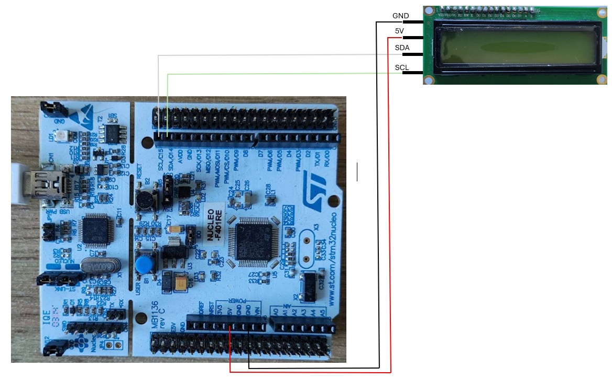  

The connections between NUCLEO-F401RE, I2C expander and LCD1602 can look like below:  

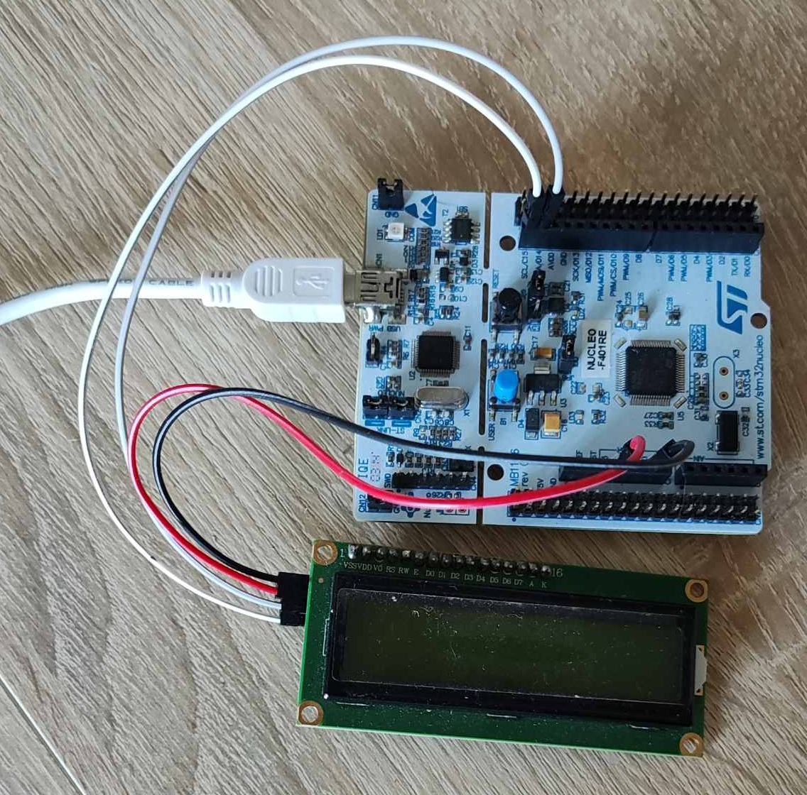  

The I2C Expander looks like below:  

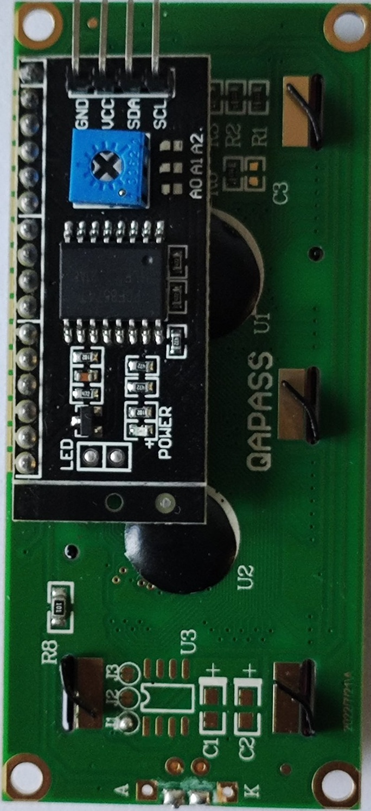  

### STM32F401RE Device Configuration

Please, take a look at the ***STM32F401_UART_LCD1602_I2C.ioc*** and analyze GPIO configuration:

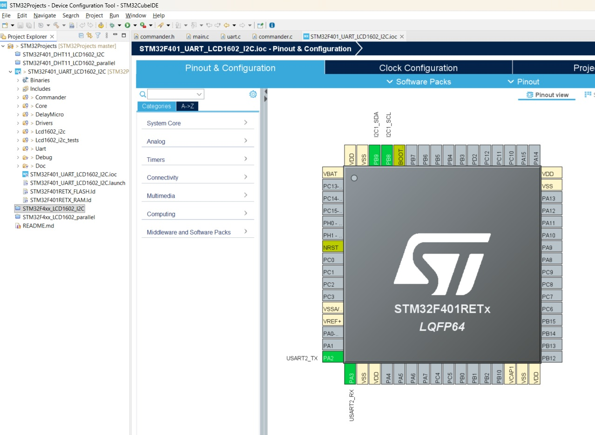  

Take a look at the Timer TIM2 configuration:

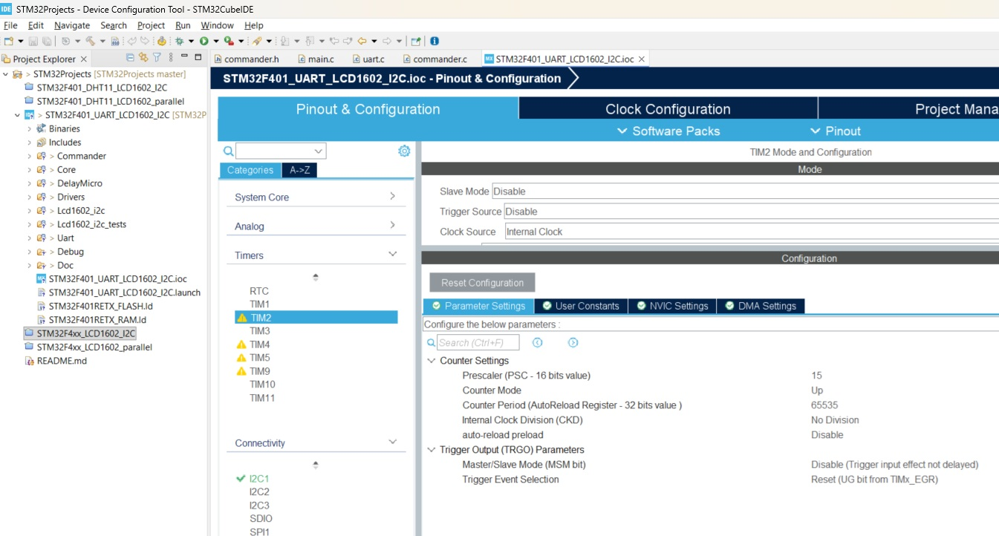  

I2C1 Connectivity configuration placed here:

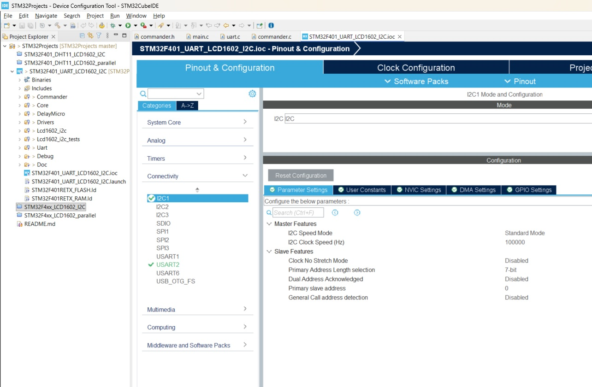  

UART2 configuration looks like below:

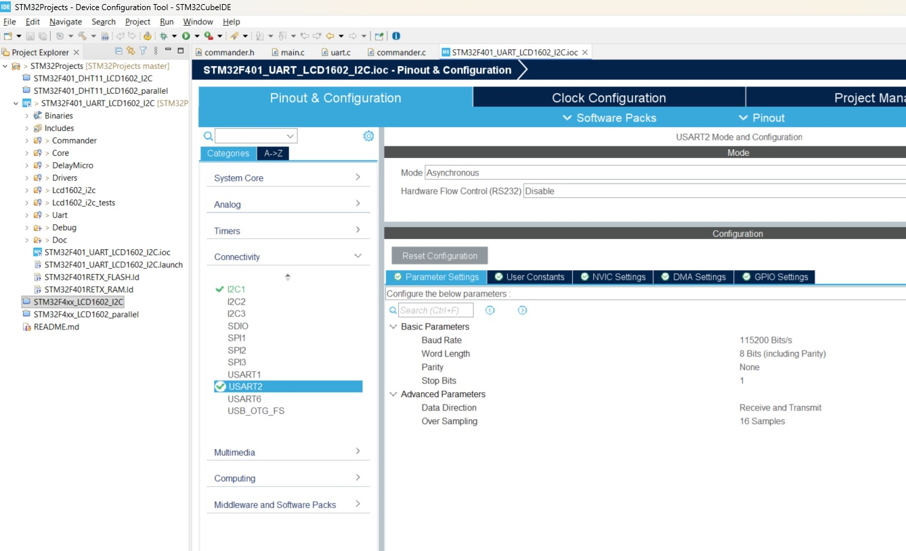  

### Windows Serial client (PuTTY) configuration

Windows Serial client (PuTTY) connection configuration should be prepared as follows:

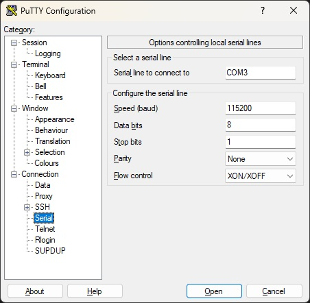

## Usage

After [Installation](#installation_id) and [Configuration](#configuration_id) steps you will be able to build and run this project on the NUCLEO-F401RE board.  

1. Connect your NUCLEO-F401RE board to your computer:

2. Start STM32CubeIDE in the workspace where you have already prepared this project. Then click on ***hammer icon*** to build the project:

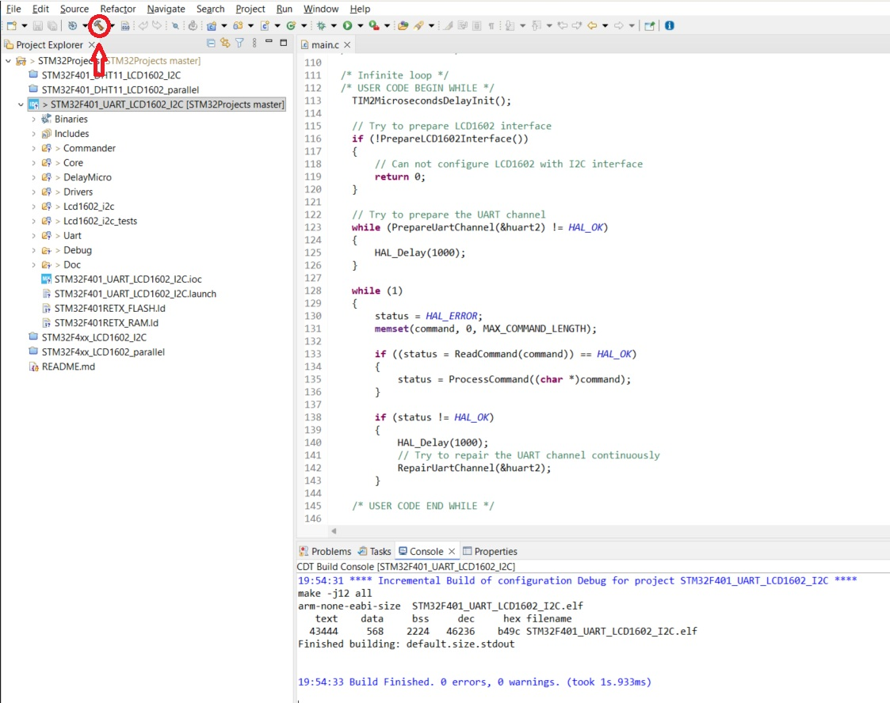

3. Getting clean build you will be able to run it on your NUCLEAR-F401RE board by click on ***Run icon***:

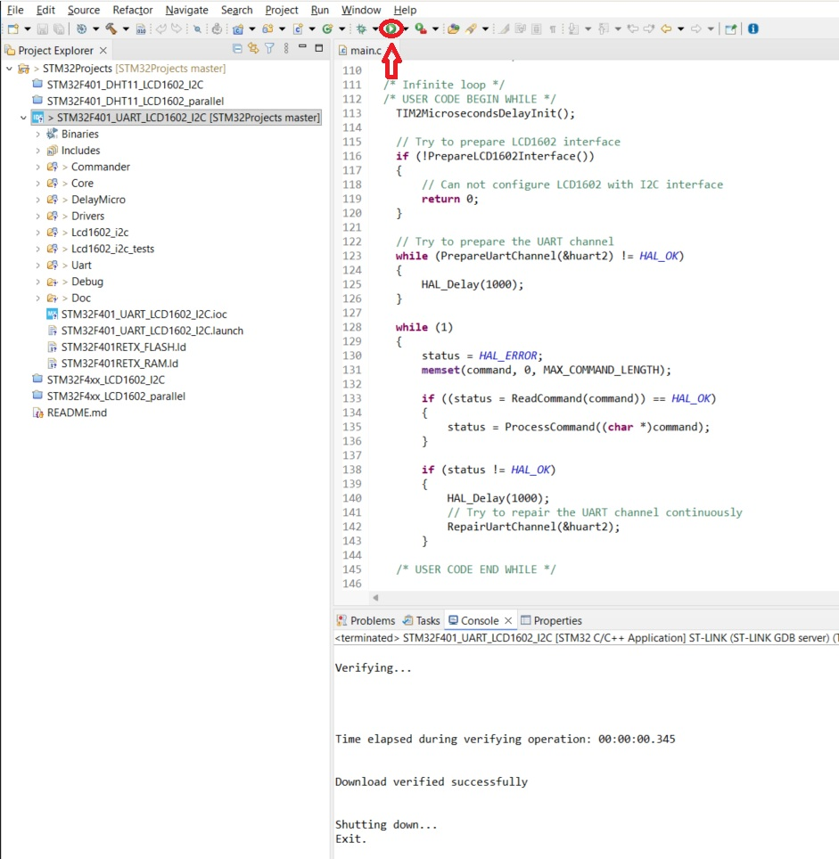

4. The binary will be downloded into the microcontroller and then it will be run.  

    - At the start time you will be able to see the message ***"LCD-1602 / I2C Interface"*** on the LCD1602 Display during 1 second.  

    - Then the message ***"Can't connect to UART channel!"*** will appear on the LCD1602 Display.

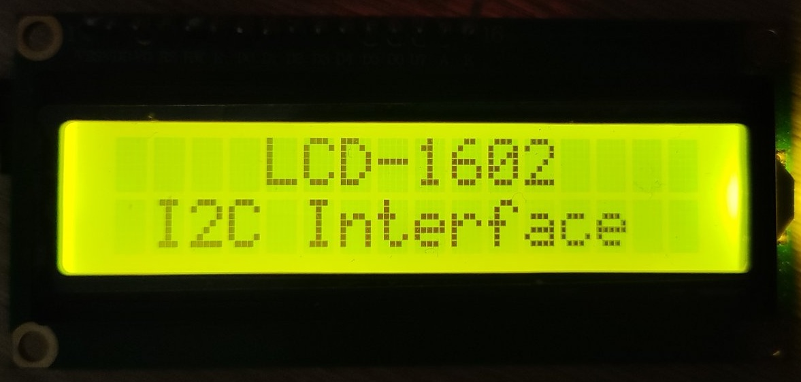

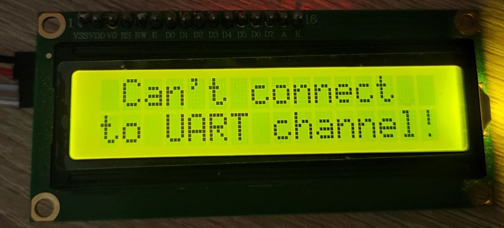

5. You should start (open) the serial client connection on your PC (see [Windows Serial client (PuTTY) configuration](#windows_serial_client_configuration_id)) by clicking on "Open" button:

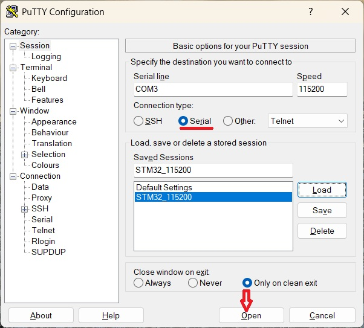

>NOTE. You should clarify the Virtual COM Port number in Your PC taking a look at the Device Manager Ports (COM & LPT). There will be ***"STMicroelectronics STLink Virtual COM Port (COMx)"*** with respective COMx.  

6. The Handshake message will appear on the Client Serial Terminal window:

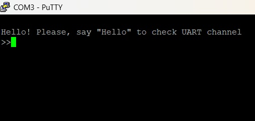

7. Answer "Hello" and you will see the list of supported commands on the Client Serial Terminal window:

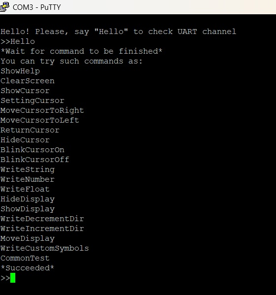

8. Also you will see the message "Send commands to UART channel!" on the LCD1602 Display.

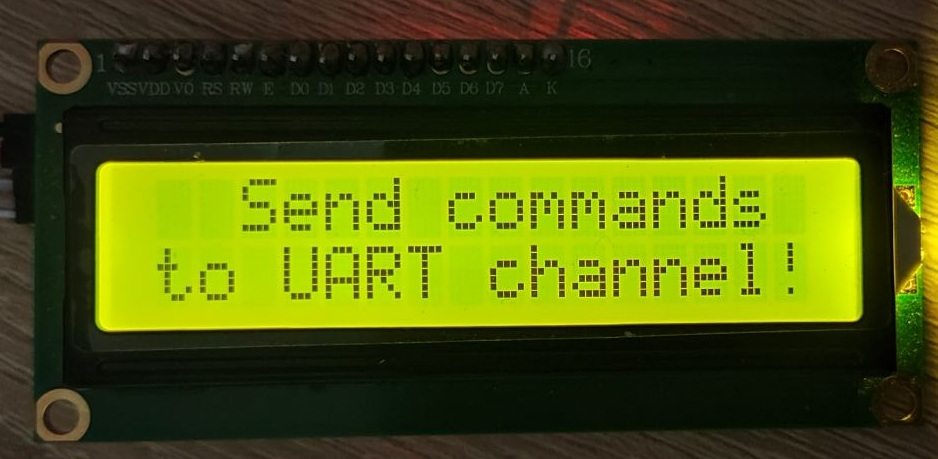

9. Now you are ready to perform manual testing of the library ***Lcd1602_i2c*** by typing any supported command (see [the point #7](#point_7_id) above).

## License

The terms of the [***FreeBSD License***](https://opensource.org/licenses/BSD-2-Clause) are applicable to the software projects of this repository.

## Acknowledgements

While working on this project I used such links as below:

1. [***UM1725. STM32 Cortex-M4 MCUs and MPUs programming manual. Rev 8 - March 2023***](https://www.st.com/resource/en/programming_manual/pm0214-stm32-cortexm4-mcus-and-mpus-programming-manual-stmicroelectronics.pdf)
2. [***STM32 Cube Hardware Abstraction Layer (HAL) library***](https://www.st.com/resource/en/user_manual/um1725-description-of-stm32f4-hal-and-lowlayer-drivers-stmicroelectronics.pdf)
3. [***DS10086. STM32F401xD STM32F401xE. Revision 4. 24-Jan-2025***](https://www.st.com/resource/en/datasheet/stm32f401re.pdf)
4. [***UM2563. STM32CubeIDE installation guide. Rev 5 - March 2024***](https://www.st.com/resource/en/user_manual/um2563-stm32cubeide-installation-guide-stmicroelectronics.pdf)
5. [***LCD MOUDULE SPECIFICATION FOR APPROVAL. Waveshare LCD1602. INITIAL RELEASE***](https://www.waveshare.com/datasheet/LCD_en_PDF/LCD1602.pdf)
6. [***Getting started with STM32 system peripherals***](https://wiki.st.com/stm32mcu/wiki/Getting_started_with_STM32_system_peripherals)
7. [***Getting started with UART***](https://wiki.st.com/stm32mcu/wiki/Getting_started_with_UART)
8. [***PuTTY User Manual***](https://the.earth.li/~sgtatham/putty/0.83/htmldoc/)

## Contacts

- Email: duoleedu@gmail.com
- GitHub: [Oleh-Dubrovskyi](https://github.com/Oleh-Dubrovskyi)

