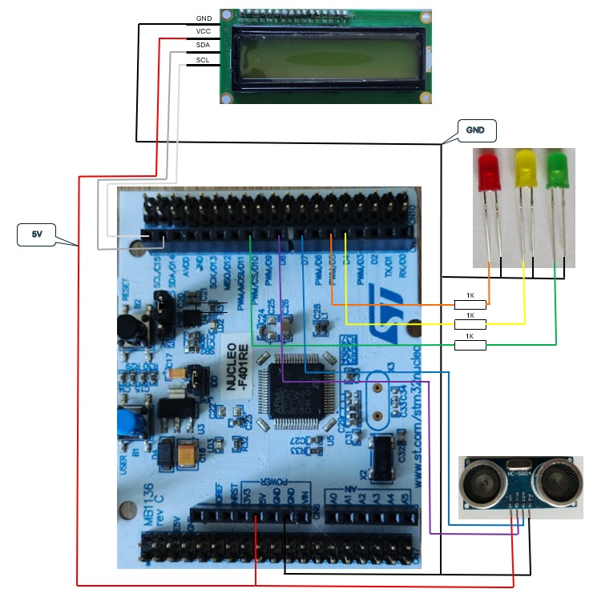
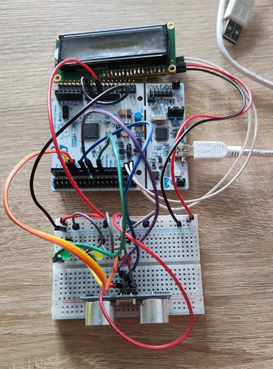
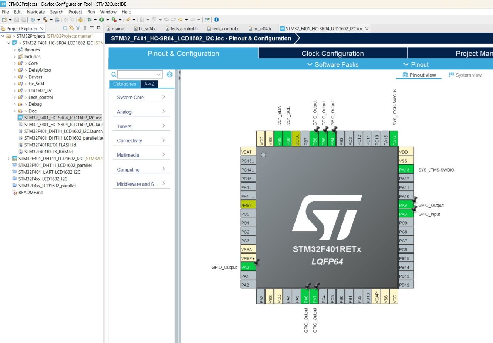
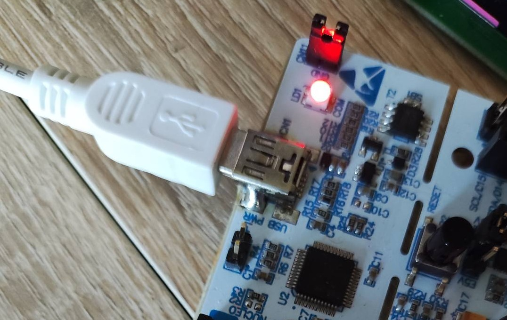
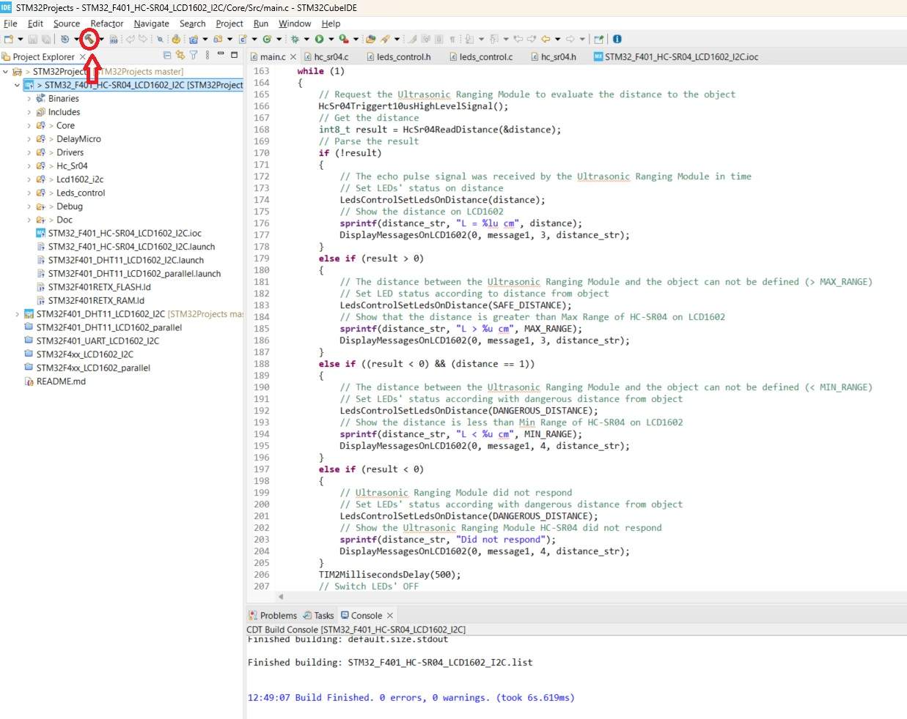
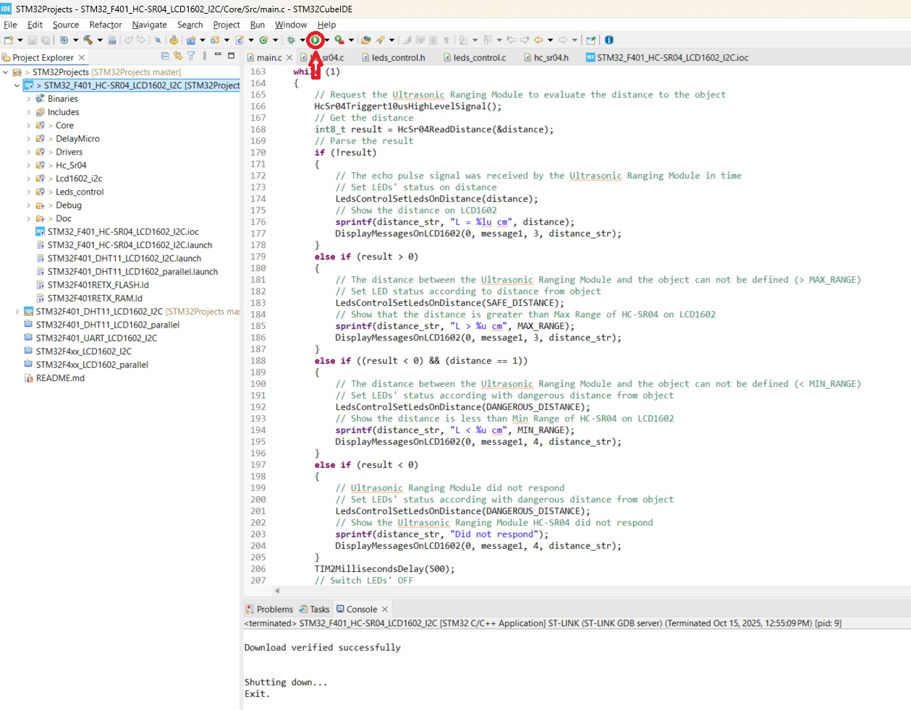
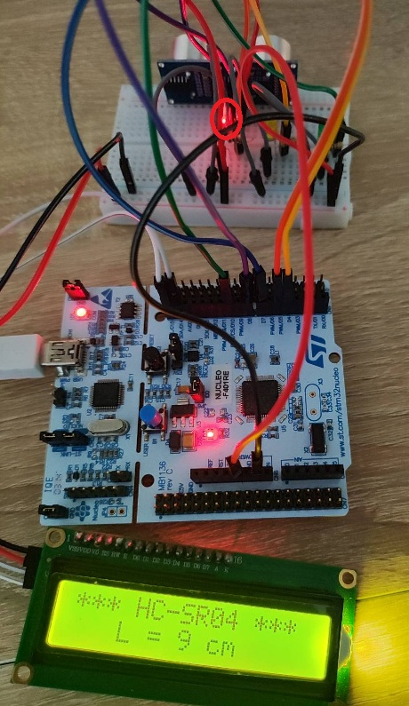
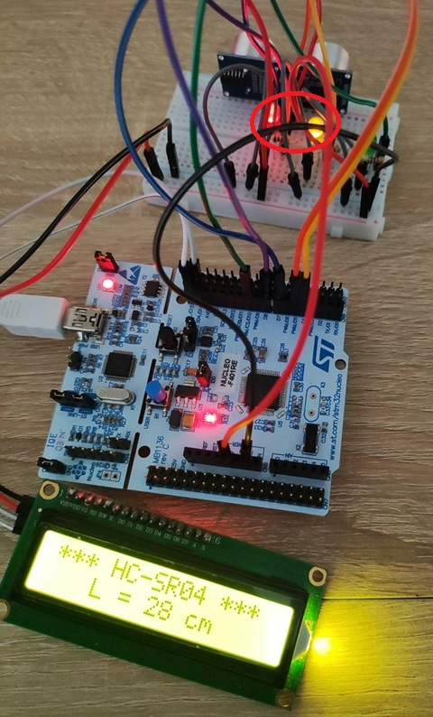
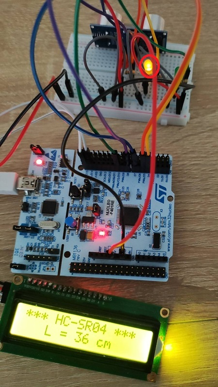
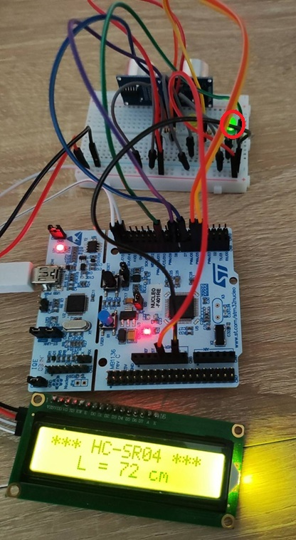

# Ultrasonic distance meter and LEDs safety level indicator  

## (Ultrasonic Ranging Module HC-SR04 and LCD1602 Display are connected to the STM32F4xx board)  

The STM32 Project ***STM32_F401_HC-SR04_LCD1602_I2C*** is intended to create an API that would help:  

- to connect ***LCD1602 Display*** to the ***STM32F4xx*** board via I2C channel;  

- to perform microsecond and millisecond delays by using ***System Core Clock*** and timer ***TIM2***;  

- to connect Ultrasonic Ranging Module ***HC-SR04*** to the ***STM32F4xx*** board;  

- to connect three external LEDs (red, yellow, green) to the ***STM32F4xx*** board;  

- to indicate the degree of the hazard of the distance by means of external LEDs.  

The project is based on the [***STM32 Cube Hardware Abstraction Layer (HAL) library***](https://www.st.com/resource/en/user_manual/um1725-description-of-stm32f4-hal-and-lowlayer-drivers-stmicroelectronics.pdf).  

## Contents

- [Contents](#contents_id)
- [Features](#features_id)
- [Installation](#installation_id)
- [Configuration](#configuration_id)

    - [Hardware elements](#hardware_elements_id)
    - [Hardware connection](#hardware_connection_id)
    - [GPIO configuration](#gpio_configuration_id)

- [Usage](#usage_id)
- [License](#license_id)
- [Acknowledgements](#acknowledgements_id)
- [Contacts](#contacts_id)

## Features

In addition to the [***STM32 Cube Hardware Abstraction Layer (HAL) library***](https://www.st.com/resource/en/user_manual/um1725-description-of-stm32f4-hal-and-lowlayer-drivers-stmicroelectronics.pdf) the project ***STM32_F401_HC-SR04_LCD1602_I2C*** uses such libraries as:  

- ***Lcd1602_i2c library***. This library was described and demonstrated in the STM32 Project [***STM32F4xx_LCD1602_I2C***](https://github.com/Oleh-Dubrovskyi/STM32Projects/tree/master/STM32F4xx_LCD1602_I2C). It is used to connect ***LCD1602*** display to the ***STM32F4xx*** board via I2C expander based on IC PCF8574T.  

- ***DelayMicro library***. This library is intended to perform microsecond and millisecond delays that are needed to support the DTH11 communication protocol. It was described and demonstrated in the STM32 Project [***STM32F401_DHT11_LCD1602_parallel***](https://github.com/Oleh-Dubrovskyi/STM32Projects/tree/master/STM32F401_DHT11_LCD1602_parallel) too.

- ***Hc_Sr04 library***. This new library was created to communicate with Ultrasonic Ranging Module [***HC-SR04***](https://cdn.sparkfun.com/datasheets/Sensors/Proximity/HCSR04.pdf) to determine the distance to an Object in front of a sensor (2cm <= L <= 4m).  

- ***Leds_control***. This new library was created to control the external LEDs status depending on a distance between the Ultrasonic Module and the Object. The distance is classified according to the degree of hazard as below:  
    - DANGEROUS (L<=10cm; RED LED is switched ON);  
    - REQUIRING SPECIAL ATTENTION (10cm < L <= 30 cm; RED and YELLOW LEDs are switched ON);  
    - REQUIRING ATTENTION (30cm < L < 50; YELLOW LED is switched ON);  
    - SAFE (L >=50; GREEN LED is switched ON).  

## Installation

1. In case you decide to build and run this project you should [***install the STM32CubeIDE***](https://www.st.com/resource/en/user_manual/um2563-stm32cubeide-installation-guide-stmicroelectronics.pdf) in your computer.
2. To clone a project from GitHub and import it into your STM32CubeIDE workspace, follow these steps:
    - Clone this repository by means of Git client or by using `git clone` command.
    - Import STM32 Project ***STM32_F401_HC-SR04_LCD1602_I2C*** into your STM32CubeIDE workspace
        - Open STM32CubeIDE and ensure you are in the desired workspace.
        - Navigate to *File* > *Import*: in the top menu bar.
        - In the *Import* window, expand the *General* folder and select *Existing Projects into Workspace*. Click *Next*.
        - On the next screen, you will have two options for selecting the project: *Select root directory* and *Select archive file*.
        - Select root directory: Click *Browse...* and navigate to the root directory of the STM32 project ***STM32_F401_HC-SR04_LCD1602_I2C*** on your file system.  
          This directory should contain file `.project`.  
          Once the directory is selected, STM32CubeIDE will display the projects found within that location.  
          Select the project ***STM32_F401_HC-SR04_LCD1602_I2C*** to import it into your workspace.
          *Optional:* If you want a copy of the project files to be placed within your workspace directory, check the *Copy projects into workspace* option.  
          If you leave this unchecked, the project will be linked to its original location on the file system.
        - Click *Finish* to complete the import process.  
          The project ***STM32_F401_HC-SR04_LCD1602_I2C*** will now appear in your STM32CubeIDE Project Explorer.

## Configuration

### Hardware elements

The project ***STM32F401_DHT11_LCD1602_I2C*** requires such hardware elements:

- NUCLEO-F401RE board
- LCD1602 Display with I2C expander based on the ***IC PCF8574T***
- Ultrasonic Ranging Module ***HC-SR04***
- One Red LED
- One Yellow LED
- One Green LED
- Three current-limiting resistors of 1 kOM

### Hardware connection

1. Connect the ***I2C Expander*** GND pin to the NUCLEO-F401RE GND (pin CN6-7).
2. Connect the ***I2C Expander*** VCC pin to the NUCLEO-F401RE +5V (pin CN6-5).
3. Connect the ***I2C Expander*** SDA pin to the NUCLEO-F401RE PB9 (SDA, pin CN5-9).
4. Connect the ***I2C Expander*** SCL pin to the NUCLEO-F401RE PB8 (SCL, pin CN5-10).
5. Connect the ***HC-SR04*** "Vcc" pin to the NUCLEO-F401RE +5V (pin CN6-5).
6. Connect the ***HC-SR04*** "Gnd" pin to the NUCLEO-F401RE GND (pin CN6-7).
7. Connect the ***HC-SR04*** "Trig" pin to the NUCLEO-F401RE D8 (PA9, CN5-1).
8. Connect the ***HC-SR04*** "Echo" pin to the NUCLEO-F401RE D7 (PA8, CN9-8).
9. Connect the Anode (the long leg) of the ***Red LED*** to the right end of the current-limiting resistor ***Rred***.
10. Connect the left leg of the current-limiting resistor ***Rred*** to the NUCLEO-F401RE GPIO D5 (PB4,CN9-6).
11. Connect the Anode (the long leg) of the ***Yellow LED*** to the right end of the current-limiting resistor ***Ryellow***.
12. Connect the left leg of the current-limiting resistor ***Ryellow*** to the NUCLEO-F401RE GPIO D4 (PB5,CN9-5).
13. Connect the Anode (the long leg) of the ***Green LED*** to the right end of the current-limiting resistor ***Rgreen***.
14. Connect the left leg of the current-limiting resistor ***Rgreen*** to the NUCLEO-F401RE GPIO D10 (PB6,CN5-3).
15. Connect the Cathodes (the short legs) of the ***Red, Yellow and Green LEDs*** to the NUCLEO-F401RE GND (pin CN6-7).

Please, take a look at the connection diagram:

  

The connections between NUCLEO-F401RE, LCD1602, HC-SR04 and LEDs can look like below:  

  

### GPIO configuration

Please, take a look at the ***STM32_F401_HC-SR04_LCD1602_I2C.ioc*** and analyze GPIO configuration:

    

## Usage

After [Installation](#installation_id) and [Configuration](#configuration_id) steps you can build and run this project on the NUCLEO-F401RE board.  

1. Connect your NUCLEO-F401RE board to your computer:

2. Start STM32CubeIDE in the workspace where you have already prepared this project. Then click on ***hammer icon*** to build the project:

3. Getting clean build you will be able to run it on your NUCLEAR-F401RE board by click on ***Run icon***:

4. The application will show the distance between the Ultrasonic Ranging Module and the Оbject in a range from 2 cm to 4 m on LCD1602.  

    - In case the distance is less or equal to 10cm the red LED should be switched ON and blink.  

      

    - In case the distance is greater than 10 cm and less or equal to 30cm the red and yellow LEDs should be switched ON and blink.  

    

    - In case the distance is greater than 30 cm and less than 50cm the yellow LED should be switched ON and blink.  

      

    - In case the distance is greater or equal to 50 cm the green LED should be switched ON and blink.  

      

## License

The terms of the [***FreeBSD License***](https://opensource.org/licenses/BSD-2-Clause) are applicable to the software projects of this repository.

## Acknowledgements

While working on this project I used such links as below:

1. [***UM1725. STM32 Cortex-M4 MCUs and MPUs programming manual. Rev 8 - March 2023***](https://www.st.com/resource/en/programming_manual/pm0214-stm32-cortexm4-mcus-and-mpus-programming-manual-stmicroelectronics.pdf)
2. [***STM32 Cube Hardware Abstraction Layer (HAL) library***](https://www.st.com/resource/en/user_manual/um1725-description-of-stm32f4-hal-and-lowlayer-drivers-stmicroelectronics.pdf)
3. [***DS10086. STM32F401xD STM32F401xE. Revision 4. 24-Jan-2025***](https://www.st.com/resource/en/datasheet/stm32f401re.pdf)
4. [***UM2563. STM32CubeIDE installation guide. Rev 5 - March 2024***](https://www.st.com/resource/en/user_manual/um2563-stm32cubeide-installation-guide-stmicroelectronics.pdf)
5. [***LCD MOUDULE SPECIFICATION FOR APPROVAL. Waveshare LCD1602. INITIAL RELEASE***](https://www.waveshare.com/datasheet/LCD_en_PDF/LCD1602.pdf)
6. [***Ultrasonic Ranging Module HC-SR04***](https://cdn.sparkfun.com/datasheets/Sensors/Proximity/HCSR04.pdf)

## Contacts

- Email: duoleedu@gmail.com
- GitHub: [Oleh-Dubrovskyi](https://github.com/Oleh-Dubrovskyi)

